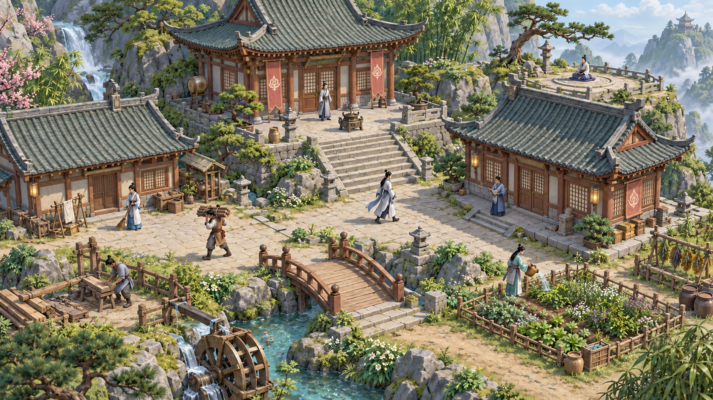

# U-103 Godot 美术试验记录（历史）

> **记录用途 · 2026-10-09：** 本文保留 U-103 的原制作范围、验收表及当时状态。U-104 已停止其后续制作并确认[Godot 二维绘画小院](PAINTED-COURTYARD.md)；当前实施与验收从新入口接续，已有工程、素材、试验网页和证据继续保留。

更新：2026-10-09。方向来源：[U-103](design/DECISIONS.md)；引擎实施：[Godot Web 路线](GODOT-MIGRATION.md)。本文保留该试验原定的制作范围和验收，实际完成情况以 [STATUS](design/STATUS.md) 的最新证据为准。

## 当时确认的方向

用户要求重新设计地图、建筑和人物，选择《山门与幻境》的整体感觉，已认可下方山院概念稿，并以“那么开始吧”批准制作真实 Godot 3D 小院。先通过实际网页检查模型、材质、比例和运动表现，用户认可实机后再批量扩展美术。

这张图是方向参考。它提供木构与青灰瓦、石阶山岩、植被层次、人物服饰和整体色彩的参照；图中的建筑数量与装饰不自动成为本批制作清单。原始文件保留，仓库副本用于后续会话稳定引用。概念图没有网页运行、动作或点击证据。

## 原定交付范围

| 对象 | 本批需要看到的内容 |
| --- | --- |
| 一栋主殿 | 完整屋顶、墙门、台基及清楚入口；比例与人物一致，缩放后仍能辨认造型和材质。封闭外观按 U-101 执行。 |
| 一段山石道路 | 山石、路面及与主殿相接的地面关系；人物站地、行走和前后遮挡清楚。这是样板场景内容，正式玩法的铺路功能另按原范围管理。 |
| 两名人物 | 同一套模型和材质规范下有可辨认的身份特征，能观察连续行走、转向与劳动；动作中身体、服饰和工具关系连续，脚步与地面移动相符。 |
| 场景交互 | 网页实际缩放、选择主殿及两名人物，清楚显示当前选择；行走、劳动和被建筑/山石遮挡时仍能判断正在发生什么。 |

模型、材质、灯光与相机共同决定最终画面，调整后以同一网页构建重新检查。样板默认采用斜俯视观察；具体相机角度、模型细节、光照和缩放上下限属于本批实施调试参数，按实际结果记录。

源场景为 `godot/art/art_courtyard.tscn`，素材在 `godot/art/assets/`，构建脚本为 `tools/build-art-web.py`，导出入口为 `dist/art-courtyard/index.html`。导出文件是运行产物；制作与复核应能追溯到对应源文件及构建。

## 与正式玩法的关系

本批验证美术与交互。演示行走和劳动用于检查模型及连续动作，不能记成 NPC 自主经营或真实生产链通过。样板不结算资源，不读取或写入正式三个档位，也不建立另一套经济世界。刷新样板后的临时状态重置按实际行为说明；正式游戏的旧存档恢复另按原门槛验收。

原游戏源码、素材和全部已存在的未提交成果保留。正式玩法继续遵守同一身份、空间和世界时钟；96米山院、2米营造格、0.5米导航精度、真实工位、关闭不推进及旧档保护继续成立。以后把新模型接入玩法时，人物动作读取真实位置和活动，经营结果由唯一模拟结算。

U-103 当时覆盖旧 2.5D 美术沿用方向；原定在实机小院获用户认可后扩展。当前制作已由 U-104 接续，本文不再作为继续制作该试验的指令。

## 原定验收表

以下保留该试验的原检查项；已取得的局部结果以 STATUS 对应历史记录为准，未取得的证据不补记通过。

| 编号 | 直接操作与需要看到的结果 | 证据类型 |
| --- | --- | --- |
| ART-RT-01 | 从网页服务打开实际导出，主殿、道路、两名人物完整出现；加载无缺模、缺材质或阻止操作的错误。 | Web 构建与浏览器首载 |
| ART-RT-02 | 在默认镜头、近景和拉远状态观察同一小院；门、人物、道路比例统一，材质与光照同场协调，并与认可概念稿并列检查差距。 | 实际运行画面；用户判断另记 |
| ART-RT-03 | 连续观察两名人物的行走、停止、转向和劳动；身体与工具动作连续，脚点和地面关系合理；人物离开劳动位置时动作反馈准确。 | 浏览器连续操作与观察 |
| ART-RT-04 | 分别点选主殿和两名人物，再缩放后重复；选择反馈对应同一对象，操作不被无关地面或建筑的大块区域抢走。 | 浏览器实际点击 |
| ART-RT-05 | 观察人物经过主殿与山石前后；深度遮挡与可见部分点选一致，完整封闭外观保持，不能透过屋体点中隐藏身体。 | 浏览器行走与遮挡检查 |
| ART-RT-06 | 操作结束后刷新、返回或重开样板；可重新进入，正式游戏三个档位及原游戏状态未被写入。构建失败或加载失败须保留源文件和原游戏入口，并记录具体错误。 | 入口隔离、失败与重载检查 |
| ART-RT-07 | 在桌面窗口与 iPad 横竖浏览器视口检查缩放、点选和说明；记录实际 CSS 尺寸、DPR、浏览器、设备及观察到的卡顿。目标平台真机结果单独登记。 | 视口与性能记录；真机另列 |
| ART-RT-08 | 用户查看本批实际网页，明确认可模型、材质、整体画面和连续动作可以作为后续扩展标准；具体修订点按反馈落实。 | 用户实机认可未取得 |

文档检查、场景导入、编辑器运行、浏览器启动、连续交互、性能测量和用户实机确认分别记录。截图只说明截图时刻，连续动作需要实际运行观察；本地浏览器与公开网页分别标明地址及版本。用户认可概念稿不能替代 ART-RT-08。

## 与 SR/AC 的对应

| 原需求 | 本批可积累的局部证据 | 仍需在玩法集成后完成 |
| --- | --- | --- |
| SR-XF-003-AC-01/02 | 模型空间、绕行及镜头下的比例、缩放和选中对象 | 同一正式世界中的门道/新建筑重规划、触点锚定、旧坐标与真实导航 |
| SR-XF-004-AC-01/02/03 | 主殿完整封闭外观与遮挡 | 正式预览/施工/成品全阶段、真实工位、管理页、缺失和旧版资产恢复 |
| SR-XF-007-AC-01/03 | 两名样板人物辨认、点选、连续动作与当前演示状态 | 三名以上人物真人辨识，正式等待/睡眠/研习等全活动与同一权威状态的对应；装备与战斗仍按 AC-02 |
| SR-XF-029-AC-01/02 | 本批网页缩放和点选、桌面与 iPad 横竖视口 | 正式建造、全系统操作、完整触控和 iPadOS/Windows/macOS 真机 |

样板检查不直接改变完整 AC、D/I/V/R 或40项 SR 的完成状态。主执行者完成实际复核后，在台账及 STATUS 记明适用子情景、版本和未覆盖范围。

## 试验结束时的确认边界

- 当时美术方向与试验制作范围：用户已确认。
- 概念稿：用户已认可。
- 源场景、Web 构建及交互检查：按 STATUS 的实际执行记录核对。
- 用户对该试验网页实机效果的认可：未取得；U-104 已停止其后续制作。
- 该路线的批量美术扩展：停止，现有成果保留。

该试验的实机差距和局部检查继续按原版本保留。当前二维场景、构建与直接验收清单见 [PAINTED-COURTYARD](PAINTED-COURTYARD.md)。
