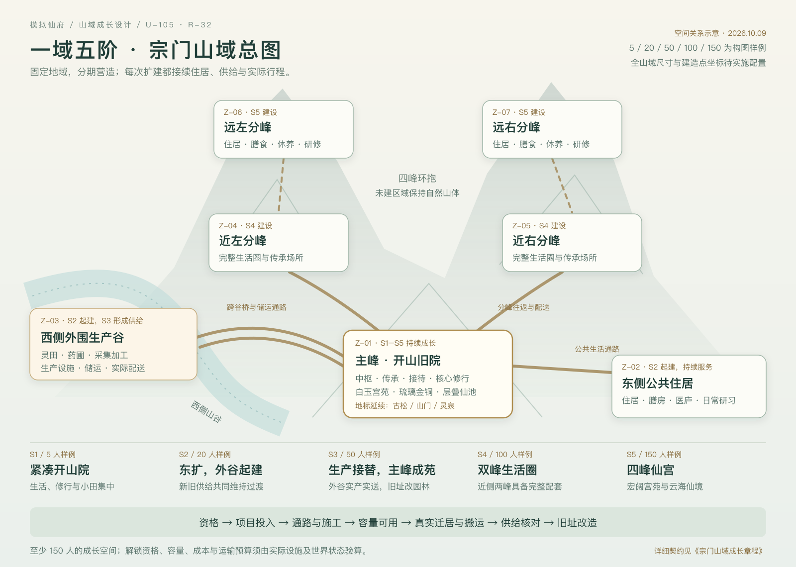

# 宗门山域成长章程

当前先执行 [U-107 宗门大山域试游](MOUNTAIN-DOMAIN.md)：约6×6公里为可调规划建议，峰内紧凑生活、峰间山岭深谷林海瀑布，保留主峰、四分峰、东住居、西生产谷与现有小院。地形、分级缩放和小院到外围连续游历按DOMAIN-01–06验收；本章建设、迁居和供给仍按GROWTH-01–12推进。

U-107最新要求拉开建筑之间的距离：主殿前庭、门人居和膳房各自院落展开，山门至主殿纵深拉长，以道路、台阶与绿地连接，人物与建筑比例保持。新图沿主殿居中靠后、门人居左、膳房右、山门前、灵泉侧的方位关系重排实际位置；U-106像素锚点保留为历史构图。现有阶段原型继续表达功能和成长顺序，预设建造点与通路须对应新布局，容量与运行验收分别登记。

更新：2026-10-09。依据 [U-105 / R-32](design/DECISIONS.md)，本批交付同一山域总图、五阶段建设迁移表与统一阶段原型，并同步空间、运行时、开局及经营设计。建筑预设位置、连续扩建、功能迁移和后期仙宫方向属于用户确认；Z-01–07 的具体分区、项目顺序与本文件的验算方法属于作者细化 R-32。

本文件是设计规格。图中的 5 / 20 / 50 / 100 / 150 人是构图与容量检查样例；升级门槛、成本、工期、供给余量和验算时长待玩法配置确定。图稿不代表建筑实例坐标、人物寻路、运行性能或网页实机验收。

## 1. 总图与阶段原型

[打开同一山域总图](art/sect-growth-20261009-v2/master-plan.svg)。总图规定主峰、公共住居、外围生产谷与四分峰的相对关系；五张原型表达这一空间方向下的建设、功能和材质变化。图稿中的局部山形、门楼及水景仍有变化，后续须在同一二维底图上确定地标锚点与建造点，才可验收严格连续性。

| 阶段 | 原型 | 本阶段的空间变化 |
| --- | --- | --- |
| S1 · 5 人构图 | [开山小院](art/sect-growth-20261009-v2/stage-01-5.png) | Z-01 内紧凑的住居、修行、小田与生活设施 |
| S2 · 20 人构图 | [东侧住居与外谷起建](art/sect-growth-20261009-v2/stage-02-20.png) | Z-02 扩建住居和生活配套，Z-03 同期开工 |
| S3 · 50 人构图 | [公共生活与生产成形](art/sect-growth-20261009-v2/stage-03-50.png) | Z-02、Z-03 形成完整功能，Z-01 转为中枢与修行 |
| S4 · 100 人构图 | [近侧两峰生活圈](art/sect-growth-20261009-v2/stage-04-100.png) | Z-04、Z-05 具备生活、膳食和修行配套 |
| S5 · 150 人构图 | [四峰环抱仙宫](art/sect-growth-20261009-v2/stage-05-150.png) | Z-06、Z-07 加入完整生活圈，主峰形成极奢华仙宫 |

正式布局要求古松、山门与灵泉成为跨阶段可辨认的地标，保持位置关系与来历连续。服务用途随阶段调整：早期灵泉支持小院生活，后期纳入园林和修行水景；原有取水服务须在替代服务成立后转换。主峰生产迁出后，旧田改为园林、庭院或修行空间。后期以白玉台基、琉璃屋面、金铜构件和层叠仙池表现仙宫气象，各阶段保留清楚的道路、入口和人物活动尺度。现有原型确定功能和材质方向，地标逐一映射仍属 GROWTH-01 待验内容。

## 2. 空间分区与功能

| 地域 ID | 相对位置与角色 | 主要功能及演变 | 通行与供给要求 |
| --- | --- | --- | --- |
| Z-01 | 主峰／开山旧院；全程保持中心地位 | 开山生活生产合院 → 庶务、传承、接待与修行中枢 → 仙宫、园林与仙池 | 早期就地供给；中后期由 Z-02、Z-03 及分峰真实配送，保留来往通道 |
| Z-02 | 主峰东侧公共住居区 | 公共住居、膳房、医庐、日常研习与生活配套；分峰形成后仍承担公共服务 | 住居到膳食、休养、研习均可达；与主峰和生产谷有连续运输联系 |
| Z-03 | 主峰西侧外围生产谷，与主峰隔谷 | 灵稻、灵草、采集加工、生产设施与公用储运；随实际服务需求分批扩建 | 谷地道路及跨谷桥梁属于真实通路；完工、可通行后才承运；危险或断路时明确等待和恢复 |
| Z-04 | 近左分峰 | 第一组分峰生活圈之一：住居、膳食、休养、研习与修行 | 先连通主峰和公共补给，再接纳迁居；峰内有日常服务，跨峰仍有行程 |
| Z-05 | 近右分峰 | 第一组分峰生活圈之二；可承接不同传承与人员安排 | 与 Z-04 同一容量规则；具体归峰与职责由人物同意及组织条件决定 |
| Z-06 | 远左分峰 | 第二组完整生活圈之一，与近峰共同围合主峰 | 山路、补给节点与峰内设施先建成，再迁居；路长纳入后勤能力 |
| Z-07 | 远右分峰 | 第二组完整生活圈之二，完成四峰环抱格局 | 同上；总览可定位在途人员、货物及具体阻塞点 |

四座分峰围合主峰，生产谷在西侧外围，公共住居位于东侧。地域 ID 代表连续地理身份，不代表建筑已落成。未建部分保留自然山体；取得资格只开放相应项目，建成范围由玩家实际投入决定。人数下降保留已解锁地域及已有建筑，运行负担按真实占用和政策结算。

既有 96×96 逻辑米山院作为 Z-01 的运行和旧档兼容基线。U-107/T-13以约6×6公里作为整个山域的规划建议尺度，后续按体验调整；各峰生活圈保持紧凑，峰间以山岭、深谷、林海和瀑布构成真实距离。实施须逐项确定各区尺度、实际道路长度与局部场景连接，保留 1 单位 = 1 逻辑米、既有 2 米营造定义与 0.5 米导航精度的兼容关系。全景范围、开放路线与正式模拟范围分别记录，不能把原型像素直接写入存档坐标。

## 3. 五阶段建设与迁移表

各行描述推荐的阶段完成形态，玩家实际工程可以处于相邻阶段之间。先补足生活与供给，再逐段迁移和改造；阶段完成不自动触发下一行。

| 阶段 | 建设项目 | 功能迁移与旧址处理 | 进入下一形态前必须成立 |
| --- | --- | --- | --- |
| S1 · 紧凑开山院 | Z-01 修缮主屋，安排真实床位、膳食、休养与研习位置；小规模灵稻／灵草田和基础取水、储料支持起步 | 人物在同一小院内完成生活、照料、收获、搬运和学习；保留古松、山门、灵泉的识别关系 | 正常来源物资足以维持已接纳人员；第一条生产及恢复路径可完成 |
| S2 · 东扩与外谷起建 | 在 Z-02 的预设位置分批建设住居及膳房、医庐等生活配套；同时启动 Z-03 通路、桥梁、储运节点和首批生产区 | 新床位及服务可用后，人员实际迁居东侧；Z-01 小田及生活产能继续承担过渡供给；外谷按完成的通路和工位逐项启用 | 新住居可达，日常服务有可用容量；外谷第一批投入、执行、到货有真实记录 |
| S3 · 公共住居与外谷成形 | 完善 Z-02 公共生活区和 Z-03 生产、储运；Z-01 改建传承、庶务、接待及修行空间 | 先将新产能、人员和货物流转接通并验证稳定供给，再逐项退出 Z-01 生产；收获／停单／搬清实物后把旧田改为园林 | Z-02 满足当前生活负荷；Z-03 完成一条包含生产与运输的完整供给周期，旧产能停用后仍有余量与中断恢复办法 |
| S4 · 两座分峰 | 连通 Z-04、Z-05；各建住居、膳食、休养、研习与修行设施，安排自愿承担职责的人 | 按归峰意愿及容量分批迁居，人物带随身物、公共物资走搬运单；Z-02 继续服务留居者及公共需求；主峰逐步扩为宫苑中枢 | 两峰各自能完成日常生活；跨峰供给、工位、授业和人员行程相容，同一人无时间重叠 |
| S5 · 四峰与仙宫 | 连通并完善 Z-06、Z-07；四峰形成完整生活圈；主峰分段建设白玉、琉璃、金铜宫群与层叠仙池 | 延续分批迁居与库存转运；主峰集中中枢、传承、仪典、接待、园林和修行用途，既有建筑通过升级或明确替代项目演变 | 四峰有可核对的住居、膳食、休养、修行及补给能力；主峰改建时保留必要服务与可达通道 |

“同一建筑升级”“整座设施迁建”“新设施接替旧设施功能”分开记录。升级或迁建沿用原 `buildingId`；新建替代设施生成新 ID，并记录接替关系。旧设施的工单、投入和库存必须逐项结束、转移或保留为可恢复状态，不能因画面进入下一阶段而消失。

## 4. 建设、迁居与存档契约

工程按以下顺序执行：**解锁资格 → 玩家选择项目与投入 → 通路和施工 → 容量可用 → 真实迁居／搬运 → 供给核对 → 旧址改造**。

1. **选择项目。** 建筑采用预设建造点。每点有稳定身份、所属地域、允许项目、阶段前置、占地、入口及通路定义；预览显示建筑实形、容量和成本。选择、查看和取消预览只改变界面；玩家明确确认后才预约材料、建立工作单。
2. **通路与施工。** 同山域道路、桥梁和连接端点使用真实可达状态。施工人员、材料和通行条件成立才贡献工时，暂停或关闭不推进。完工按同一事务更新占地、导航、入口和容量；具体道路速度加成待玩法配置。
3. **容量启用。** 床位、膳食处理位、疗养位和学习位分别验收。地块已解锁、建筑已画出或工程部分完成均不等于完整容量可用；可提前使用的分段须单独定义。
4. **安全迁居。** 归峰／迁居先取得人物接受并预约合法目的地。活动中的人物按既有活动规则完成或中断；伤者保留安全休养与治疗，必要搬送需实际执行。无安全目的地或路线时等待，保留当前床位和必要服务。人和携带物经真实行程到达后才释放旧占用。
5. **生产接替。** 新产能实际执行、产物入库、送达需求区并通过供给核对后，旧设施才逐项退出。尚未收获的田地与未完批次按规则完成或取消，已用投入、返料和产品各结算一次。
6. **中断与恢复。** 缺料、断路、人员受伤／退出、目的地满员、仓储不足分别显示原因；恢复原工作单或创建有来源的接续单。货物保留真实位置、所有权和预约，不能在失败时回到两处。
7. **保存。** 保存地域解锁、工程阶段、布局版本、接替关系、迁居／运输活动、工位预约、库存位置及唯一结算凭据。施工、在途与收尾阶段读档后继续同一事实；暂停、后台与关闭遵守唯一世界时钟。
8. **旧档。** 保留原文，隔离校验再迁移。旧自由布局和已有 96 米空间先保留可恢复映射，不能凭人口重摆建筑；人数、身份、关系、物品、库存、工时、已用材料、时间、随机和结局守恒。无法映射到预设位置时进入明确兼容／待安置状态或拒载保原档，完成安全迁移前保留原服务。

人物行为按所需服务寻找可用设施与工位，例如休养找合法疗养位、研习找获准书案。布局层负责将所选设施、工位和建造点解析成坐标及路径；行为规则不依赖“东侧第几栋”或固定像素。这一边界供后续摆放能力扩展使用，本批实施目标仍为预设位置。

## 5. 容量与供给的验算方法

容量由实际设施、工位和人物日程决定。原型中的建筑数量只用于构图；实施前为每个阶段选择一份有来源的世界状态，列出居住者、访客、伤者、在途者与愿意承担工作的人，再填写下表。

| 项目 | 应核对的量 | 阶段启用／迁移条件 |
| --- | --- | --- |
| 住居 | 需安置人数、可达可用床位、已有预约、伤者专用位置与过渡空位 | 每位迁居者有合法去处；过渡余量是明确可调参数，不用建筑外观推算床数 |
| 膳食与用水 | 有效库存、消耗率、烹饪／取水能力、到货间隔及搬运耗时 | 产出和配送共同满足本次负荷；在途及已预留量不能重复计为现货 |
| 生产 | 实际投入、愿意执行者、有效工位、工作时段、成熟／加工周期和收纳能力 | 有效产能取这些条件形成的实际瓶颈；图中田亩和作坊存在不直接产生收入 |
| 休养与研习 | 合法床位／书案、导师时间、开放权限和身体条件 | 不同活动可按时段使用容量，同一人物同一时刻只占一个身体活动 |
| 运输 | 每条路线长度、可达性、携带量、装卸／往返时间、运输人手及备用来源 | 从 Z-03 到主峰、公共住居及各峰的货物均有到达记录；维护和中断时间计入预算 |
| 改建期间 | 新旧设施可用时段、迁出人数／货量、服务空档、待完工单和投入 | 任一步骤都能恢复或等待；退旧后仍满足需求且有可说明的安全余量 |

对同一检验窗口 W，逐类核对：**期末总实物 = 期初总实物 + 真实产出 + 外部实际收货 − 实际消耗 − 对外交付 − 明示损耗**。总实物包含在途及预留量，宗门内搬运只改变位置；用于某区新任务的可用量另由该区有权限且可达的现货扣除有效预约和不可用量得到。预留、释放、运输和消费各有账目，消费已预留材料时不能重复扣一次可用量。建议 W 至少覆盖本次接替链中最长的生产、补给与往返周期，并安排一次已设计的供给中断与恢复检查；W 的具体世界步数和安全余量在实现时登记来源。

5 / 20 / 50 / 100 / 150 人样例分别填写同一张验算表，不能据样例数直接开放分峰。小而精路线继续可行；大宗门的更多并行能力须承担相应生活、物流、职责和维护成本。分峰仍按 SR-XF-026 的传承、人才、设施、供给与公约条件推进。

## 6. 正常、失败、存读与界面验收

本批 GROWTH 条目是新增设计门槛，当前运行验收均为 `not_run`。设计审阅、原型审阅、网页交互和正式玩法验证分别登记。既有 SR/AC 的历史证据保留其适用版本，不能转作本山域新实现的通过证据。

| ID | 类别 | 可复验的通过条件 |
| --- | --- | --- |
| GROWTH-01 | 设计／原型 | 总图与五张图的 Z-01–07 方向、四峰围合、隔谷道路及古松／山门／灵泉关系一致；各阶段用途与第3节一致，画面说明为阶段原型 |
| GROWTH-02 | 正常建设 | 资格达成后仅开放项目；确认、运输、施工和完工逐段发生；新容量只在合法阶段启用，降低人数仍保留已解锁区 |
| GROWTH-03 | 正常迁居 | 从 S1→S2 及 S3→S4 各完成一批自愿迁居；同一人实际走到新床位，携带物和原占用正确转移 |
| GROWTH-04 | 正常供给 | S2→S3 由外谷生产并实际配送；按登记窗口验算通过后才退出旧产能，旧田的批次／实物清理后改为园林 |
| GROWTH-05 | 四峰生活 | S4→S5 四峰住居、膳食、休养和修行均有真实容量，跨峰人员与物流行程可查，主峰施工不阻断必要服务 |
| GROWTH-06 | 失败／恢复 | 缺料、断桥、满床／满仓、施工者退出分别导致具体等待；恢复条件后原投入及进度接续，取消返料只一次 |
| GROWTH-07 | 人员安全 | 睡眠、生产、受伤治疗及携货中的人物遇改建时安全结束／中断或等待；无合法目的地时保持必要服务，不重建人物 |
| GROWTH-08 | 存读 | 在通路施工、容量启用前后、迁居在途、生产接替和旧址改造各保存重载；身份、工单、预约、物资位置与一次结算结果一致 |
| GROWTH-09 | 旧档兼容 | 有来源旧自由布局／96米档能确定映射或进入明确兼容状态；未知布局拒载保原档，重复迁移不改时钟、RNG、资产和既有结局 |
| GROWTH-10 | 界面／输入 | 总览进入 Z-01–07 后选择相同人物／建筑；项目卡显示资格、施工、容量、迁居及缺口的实际状态；桌面和 iPad 横竖视口的点击、缩放、取消与重载可用 |
| GROWTH-11 | 时钟／守恒 | 暂停、后台、关闭、查看总图不推进；同一世界步的近景／总览结果一致，人数、物品与库存无副本，资源总量与转移账可核对 |
| GROWTH-12 | 负载／实机 | 为五个人口样例分别记录实际人数、建筑数、活动、浏览器、设备、CSS视口、DPR、帧间隔和模拟耗时；目标设备与真人辨识另列证据 |

## 7. SR 对应与交付边界

| 既有需求／验收 | 本章关联 |
| --- | --- |
| SR-XF-003-AC-01–03 · 空间、导航与镜头 | 山域分区、实际桥路、坐标与旧布局；GROWTH-01/02/09/10 |
| SR-XF-004-AC-01–03 · 预制件、内部容量与素材 | 五阶段外观、施工、真实容量与封闭建筑；GROWTH-01/02/05 |
| SR-XF-005-AC-01–03 · 选址、施工与入口安全 | 现行营造按 U-105 使用预设建造点；旧自由选址通过事实保留，新设计以 GROWTH-02/06/10 验证 |
| SR-XF-006-AC-01–03 · 升级、迁建与拆除 | 功能接替、旧址改造与活动安全；GROWTH-03/04/06/07/08 |
| SR-XF-009-AC-01–03 · 供给链与配方产能 | 实际生产、共享批次及停用接替；GROWTH-04/05/06/11 |
| SR-XF-010-AC-01–03 · 位置库存与搬运 | 外谷／分峰配送、个人财物、预约与守恒；GROWTH-03/04/06/08/11 |
| SR-XF-011-AC-01–03 · 交易、补货与订单 | 外部补给作为有来源替代能力，受有限现货、道路及交付约束；GROWTH-04/06 |
| SR-XF-026-AC-01–03 · 立派、任职与分峰 | 能力门槛、归峰意愿、职责和时间冲突；GROWTH-02/03/05 |
| SR-XF-029-AC-01–03 · 操作与目标视口 | 项目选择、总览定位、迁居反馈与恢复；GROWTH-10/12 |
| SR-XF-030-AC-01–03 · 完整迁移 | 布局版本、历史成果、存读失败与恢复；GROWTH-08/09/11 |

U-105交付设计与阶段原型；U-107已授权先实施山域地形、分级缩放及开放路线游历，具体状态见 [STATUS](design/STATUS.md)。真实施工与迁居、四峰供给、150人运行负载仍待对应实现和验证。U-104/U-106 两人绘画小院的网页证据及用户美术确认保持各自适用范围。后续按本章选择有界实施批次，逐项登记 GROWTH 与原 SR/AC 的对应证据后推进状态。
