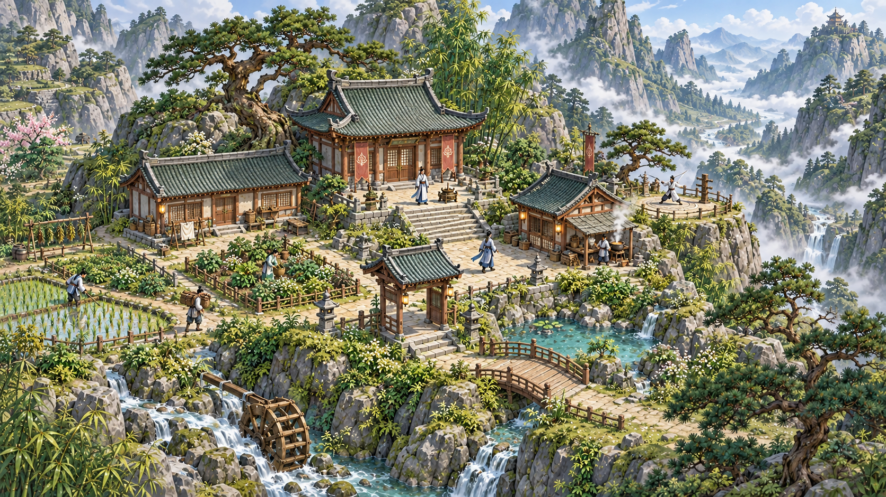
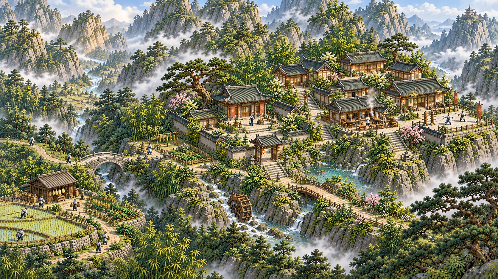
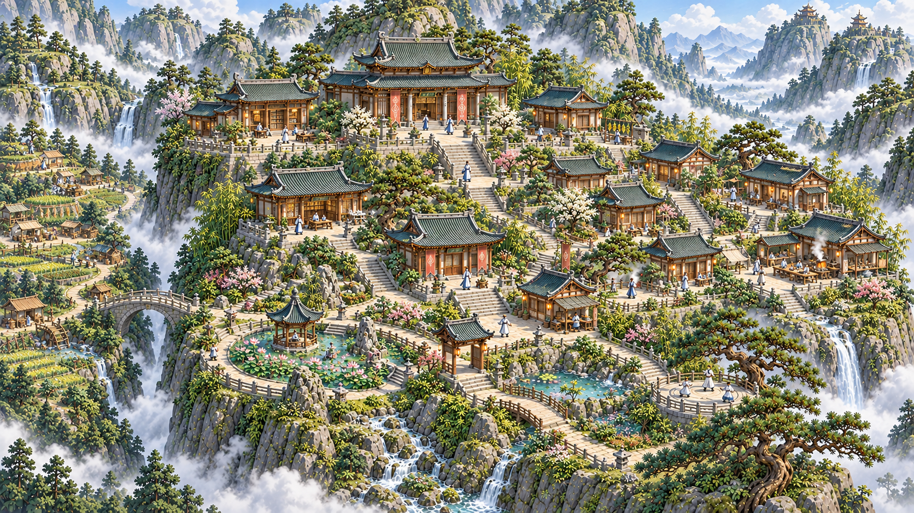

# 宗门山域 · 五阶段原型

2026-10-09。依据 U-105 / R-32 制作；建设、功能迁移与容量规则见[成长章程](../../SECT-GROWTH-PLAN.md)。人数为阶段构图样例。总图规定七区的相对关系，画稿表达空间用途、建筑材质与仙境意境；精确地标、建筑坐标及实际容量由后续二维布局配置确定。

## 山域总图

[可缩放的 SVG 总图](master-plan.svg)

## S1 · 5 人 · 开山小院

紧凑的生活、修行与初始生产，古松和灵泉建立开山山居的识别。

## S2 · 20 人 · 东扩与外谷起建

东侧住居和公共生活开始成组；西侧隔谷启动生产，开山院继续承担过渡供给。

## S3 · 50 人 · 公共生活与外谷成形

外围生产与配送形成接替能力，主峰转为宗门中枢、修行和园林。

## S4 · 100 人 · 双峰仙府

近侧两峰形成生活修行组团，主峰宫苑展开；远侧山峰保留自然山体。

## S5 · 150 人 · 四峰仙宫

四座分峰环抱主峰仙宫。白玉、琉璃、金铜、云廊与层叠仙池构成成熟意境，东侧公共住居和西侧外围生产谷继续承担各自用途。

## 交付与验证范围

五张原型均由内置 imagegen 生成，提示词见[prompts.json](prompts.json)。总图为可编辑 SVG，并导出 PNG 便于阅览。S1 延用现有开山原型，S2–S5 按本批分区和材质方向制作；原有图稿保留。

本批检查图片可读性、阶段功能分区、主峰与外谷的区别、双峰到四峰的变化、总图排版及文档链接。需求台账的 JSON、决策来源和依赖通过 `python3 qa/sr-manager.py refresh` 与 `validate` 校验；受定义影响的历史 AC 以版本方式保留。

图稿中的局部山形及古松、门楼、灵泉尚需在同一二维底图上逐一固定，GROWTH-01 保持待验。用户最终美术认可、建筑容量、真实通路、施工、迁居、供给、存读、150人负载及目标设备表现分别留待后续验证。本批为设计与原型源码交付，正式游戏网页继续使用既有版本。
