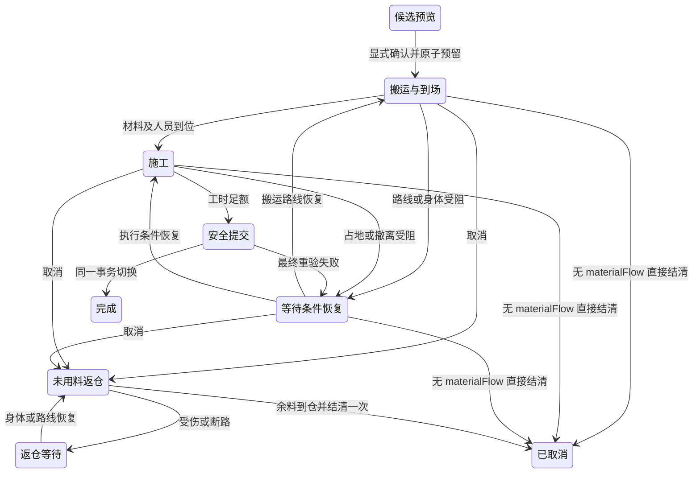

# SR-XF-003–006 · 米制小院与安全营造实施设计

版本：SR空间契约 1.0；基线：DB-2026-10-05 v1.2；2026-10-06。具体数值是R/T作者实现默认，不声称用户逐项确认。

## 唯一空间与迁移

| 参数 | 实施值 / 来源 |
| --- | --- |
| 场景 | `scene:yunxiu-courtyard`，当前96×96逻辑米（U-100/R-29）；旧无范围标记的合法米制档先按64×64边界校验，再确定迁移，标记 `courtyard-96-1` |
| 导航/放置格 | 导航0.5米；当前建筑占地和新选址按2米单位格对齐（U-99/R-28）；旧半米合法位置只走一次有记录迁移 |
| 人物体积 | 半径0.26米，成人视觉高度1.8米；R |
| 镜头 | 山院固定正交45°斜俯视，纵深0.62，近景默认32 CSS像素/米；世界脚点不随镜头旋转（U-100/R-29） |
| 朝向 | 仅south；其他朝向没有资产，不开放镜像替代 |
| 旧像素映射 | x/32、y/(32×0.65)，确定映射后合法脚点修复 |
| 新版守卫 | `s.spatial.version=spatial-metres-1`；范围 `extentVersion=courtyard-96-1`；建筑 `buildingGridVersion=building-units-1` |

SR-XF-003 的局部米制场景范围包括山院与山外实际进入的局部场景；地区总览和跨场景旅行只引用局部场景身份、入口与持久位置，不另造一套脚点。下表区分当前实现与 [03 §3](../../design/03-SPATIAL-ART.md#3-坐标比例与镜头) 的 R-27 作者默认目标；固定 45° 是平面投影角。

| 局部场景 | 现行边界与移动 | 现行镜头 | 设计目标及实施状态 |
| --- | --- | --- | --- |
| 云岫山院 `scene:yunxiu-courtyard` | 96×96 米；人物半径 0.26 米，0.5 米八向 A* 与连续扫掠；营造占地按 2 米格 | 固定平面旋转 45°、纵深 0.62、近景 `32×zoom` CSS 像素/米 | 当前 R-27/R-29 山院实现；世界脚点、入口与投影逆变换共用米制坐标 |
| 山外局部场景 `WORLD_SCENES[sceneId]` | `viewSRWorld` 视图 64×48 米；`moveWorldSR` 可走脚点须在 `x=2…62,y=2…46`，避开物件扩展矩形；终点先吸附 0.5 米节点，再按四向半米广度寻路 | 固定平面旋转 45°、纵深 0.65，近景 `32×zoom` CSS 像素/米 | 局部场景已使用同一米制投影／逆变换、边界夹取和触点缩放；建筑与地物按四角足迹绘制。镜头、点选和存读的本批局部证据按 SR-XF-003 记录，目标设备与整项门槛另验 |

山外局部场景的封闭房屋、书阁、商铺与仓储绘制外墙和屋顶；占地内人物保留真实位置、活动及存档，但不在画布绘制或抢占屋顶点选。当前地点卡仍按姓名提供人物详情入口。桥、阵台、码头和露天资源点保持可见作业者与实地点选；屋顶的抬高画面和地面占地都选择同一物件。镜头切换、点选和详情查询不得推进世界步或改写人物位置。

### 坐标、投影与视口（SR-XF-003-D01-1）

以下是当前山院的 R-27/R-28/R-29 实施参数，设计目标来自 [03 §3](../../design/03-SPATIAL-ART.md#3-坐标比例与镜头)、同一位置/时钟约束来自 [05](../../design/05-RUNTIME-CONTRACTS.md)。世界平面原点为院落逻辑坐标 `(0,0)`，`x`、`y` 各在 `[0,96]` 米内；人物的持久位置是连续米制脚点，须离场景四边至少人物半径 `0.26` 米，且脚点到墙、家具、水面、北坡等障碍的最短距离不小于该半径。建筑 `transform` 是占地左上角的世界锚点，局部门、床和工位坐标按同一锚点平移；建筑本体须在四边各留至少 1 米，并在南门外留 1 米。地形水面为 `x=58…64,y=8…30`，北坡为 `y=0…1`；`x=30…34,y=57…64` 的归院入口只限制营造，不作为人物通行障碍。山外人物同样持有自身所在 `sceneId` 下的米制 `x,y`，不能将山院锚点或旧像素换算直接套到山外。画面背景、地表背层与贴图像素均不改变这些世界坐标或命中坐标。

山院近景 `a=π/4`、`depth=0.62`、`scale=32×zoom` CSS 像素/米，`zoom` 夹在 `0.35…2.5`。屏幕地面点按 `sx=ox+(x cos a−y sin a)×scale`、`sy=oy+(x sin a+y cos a)×scale×depth` 投影；输入先减画布的 CSS 矩形左上角，令 `X=(sx−ox)/scale`、`Y=(sy−oy)/(scale×depth)`，再以 `x=X cos a+Y sin a`、`y=−X sin a+Y cos a` 逆投影。无旋转旧调用入口仍可用 `a=0`；它不是山院镜头的持久朝向。`ox,oy` 由当前视口、焦点和平移求出，再按投影后整院边界夹取：院景大于视口时不露出大片院外空白，院景小于视口时居中。总览以 `(48,48)` 为焦点，比例为 `0.88×min(视口宽/投影整院宽,视口高/投影整院高)`；近景初始聚焦掌门脚点。滚轮以指针、双指以两触点中点对应的世界点为锚；总览按钮放大以选中人物脚点或建筑入口为锚，边缘夹取优先保证院景在视口中。无有效选中时回到掌门脚点。投影/逆投影与输入始终使用 CSS 像素；位图 DPR 当前上限 `1.75` 仅影响清晰度，不改变世界比例或点选范围。

默认近景成人按 1.8 米绘制，对应约 57.6 CSS 像素的未缩放目标高度，落在 [03 §3](../../design/03-SPATIAL-ART.md#3-坐标比例与镜头) 的 44–64 像素可读目标内。成人逻辑高度建议 1.6–1.9 米、门高 2.1–2.4 米；预制件通行门宽当前 1.4 米，门的画面高度与人物应随同一镜头比例变动，不允许总览另造固定尺寸人物。门柱当前按 2.2 米画；各阶段图集的实际门、人比例仍须逐建筑量测。封闭建筑保持完整外观，内部人物虽占真实脚点、床位和工位，院景不绘制其身体；露天作业者按实际脚点可见、可点选（U-101）。

建筑米制位置只读取`building.transform`，预制件从类型和级别生成；旧x/y仅保留地址兼容，不参与现代碰撞和绘制。人物脚点仍是同一人物记录的`master.scenic`或`mind.scenic`，数值真正转换为米，不建立第二份演员。位置/关系/资产/时钟不因切镜头重建。旧布局冲突按距离、y、x稳定排序的全部半米合法位置确定安置；每次加入建筑同时复核新入口与全部已安置入口的连通性及双向0.65米保护，不能让新入口落进旧开放药田的占地。记录原目标、实际目标、原因；没有足够合法空间则拒绝迁移保留原档，绝不删资产。缺失旧脚点优先主屋门外，多个旧人重叠时按同一顺序选择最近互不重叠脚点并记录，不变更身份或关系。迁移不推进时钟或发资源。

总览中的按钮放大以当前选中人物脚点或建筑入口为世界锚，优先置于可见画布中心，靠近场景边界时以边界夹取后的可见位置为准；没有有效选择时以掌门为锚。按钮不沿用已离开画布的旧悬停点。滚轮和双指手势若给出明确触点，则保持该触点对应的世界点；边界限制仍适用。人物与建筑的数字 ID 可相同，聚焦和人物标签均须同时核对选择类型。镜头操作只改变查看状态，不写回人物、建筑、时间或存档。

半米八向A*使用连续扫掠验证每段，人物半径约束墙、家具、水面与斜坡。碰撞派生缓存使用2米空间桶索引；连通性复核重用仍可安全扫掠的原路线，失效时重新寻路；这些缓存不写入存档、不降低碰撞半径。全部可走地面参与导航，已脱离旧固定画卷道路。路线缓存/工位定义按建筑类型、级别、真实变换及geometryRevision失效。门口宽1.4米。扫掠使用线段与障碍多边形边缘的连续最短距离和相交判定，不再使用0.08米离散采样；长导航段与逐tick短步必须给出一致碰撞结果，不能穿薄墙或因采样错位在墙角反复重规划。2米建筑格只决定占地/选址，不放大人物或导航步长。

### 导航、门道与变化（SR-XF-003-D01-2）

导航图只在寻路时取 0.5 米节点，八向边和从实际连续脚点接入节点的边都须对半径 `0.26` 米的人物圆盘做整段扫掠；斜边不能掠过墙角。若起终点可直达，保留连续终点；否则 A* 后仅在整段扫掠仍合法时缩短拐点。一般寻路允许目标在最多 2 米内找最近合法脚点；门、工位、施工到场和入口连通性必须要求精确目标（`maxSnap=0`），找不到即等待或明确拒绝，不把动作算作到达。门开在预制件南边局部 `(宽/2,高)`，净宽 1.4 米，门外实际接触点 `(宽/2,高+0.6 米)`；内外路线、床/工位路径和施工后旧入口路线都按同一墙、家具和半径检验。新建和迁建确认前检测候选占地、门外前后双向 `0.65` 米保护、工地预约及当前具名人物占位；升级先检查候选占地、门道、预约和通路，施工切换占地前再检查人物占位与安全撤离。三者均验证从归院起点 `(32,56)` 到新旧全部入口可达；确认不合格不扣费，完工复核不合格不切换占地。

门道同时是单人通行资源：同一入口每个世界步最多由一人持有通行权。多人到达时按首次到达的世界 `tick`、再按稳定 `personId` 排队；同一 tick 收齐候选，下一世界步才授予队首通行权。持有者完成过门后释放，受伤不能继续原身体活动、离开场景、死亡或改派任务而取消原活动时也释放，并保留本 tick 的释放标记，下一世界步才交棒。仍有有效原目标的等候者按原队序重试，先复核门道、路线和人物占位；失败则留在合法脚点等待，不改写原活动、工位预约、材料或进度。排队、释放和重试均由同一模拟时钟及真实人物活动驱动，绘制、点选、管理查询、关闭或后台不能推进它们。这是 [03 §10](../../design/03-SPATIAL-ART.md#10-通行工位与产出事实) 的 R 类作者默认；本批已有运行时单人门权和定向回归，完整 SR-XF-003-I01/AC 状态仍以台账的独立验收为准。

此容量规则只约束预制件实际有墙、需跨越南门开口的封闭建筑；露天田块、泉边和开放工位仍按人物圆盘与各自槽位避让。持久记录为 `s.spatial.doorQueuesByEntryId[entryId]`，`entryId` 取稳定建筑实例 ID 加 `/entry:south`；每项保存 `holder`、`waiting` 和 `lastPassTick`，候选记录包含 `entryId`、`personId`、`firstArrivalTick`、原 `activityId`、原目标脚点及进门/出门 `phase`。`holder` 仅在人物脚点沿合法扫掠路径穿过该门开口并到达目标侧的合法门内/门外脚点后算完成，不以走到门中心、动画帧或管理页显示代替；完成后释放持有权，下一有效候选从下一世界步按原队序重试。同 tick 的等候者按 `(firstArrivalTick,personId)` 排序；后来的有效持有者、原目标和队序经存读保留。旧有效档缺整份门道队列时按空队列解释，直到真实过门请求才建立字段，旧档存读本身不改人物、时钟、任务或库存；非法队列字段拒载，活动、地点或入口已失效的队项在隔离读档副本中幂等释放。门外等候者可以沿真实路径移到合法侧位，原活动与工位目标保持；没有合法侧位则原地等待。

静态障碍仅从地形与当前建筑预制件的墙、家具和灵泉占地派生；空间桶与已记住的入口路线是只读缓存。建筑类型、级别、2 米格版本、室内布局、实际变换、范围版本或 `geometryRevision` 变化后，按新几何废弃相关缓存；入口连通性先逐段复核旧路线，失效才重新求路；人物持有的活动目标按新几何重新求路。移动中的每个世界步再扫掠本段，阻挡时人物停在合法脚点并清除失效路线；拥有原目标的活动在后续世界步按新几何重求，仍无路则显示等待/受阻，保留进度、材料和身份，独占预约按所属活动的安全规则释放或重验，不穿墙或瞬移。渲染帧、镜头缩放与只读查询不得触发这些重算或推进世界步。

人物临时占位的设计规则沿用 [03 §10](../../design/03-SPATIAL-ART.md#10-通行工位与产出事实)：当前具名人物的 `0.26` 米圆盘阻止新营造覆盖，也阻止两个撤离终点重叠（中心距至少 `0.53` 米）。每段实际移动先检查其他院内身体；受挡时从邻近可达半米节点局部避让，无路则保留原路径与目标、在后续世界步重试，不因人群变化每渲染帧全院重寻路。没有身体任务的本地人物若挡住唯一通路，可按真实路线以每步不超过 `0.13` 米走到同侧可达的让行脚点；找不到脚点则等候，不改人物身份、任务、库存或工位预约。已启用 `autonomy:yunxiu:v2` 的两名门人若均在前往设施工位且相互等待，可由一人按真实合法路径暂让，每世界步移动不超过 `0.13` 米；侧步期间保留原身体活动、目标及工位预约，精确存读后继续走向原工位。封闭门道候选按上述单人队列让行，等候位置与持有人的连续脚点中心距仍至少 `0.53` 米。一般公开走近已占脚点可在原目标两米内选最近合法脚点；门、工位和施工执行位仍严格 `maxSnap=0`。施工主屋材料仓若被实际身体占住，可在仓的南侧 `1.25` 米内选与其他人相距至少 `0.53` 米、同一场景且沿静态扫掠路径可达的精确取料接触脚点；掌门须真实走到该点才取料，源仓位置、货量和工单不变。没有这样一个脚点时施工保留货物、预约和进度并显示阻断；此接触范围只用于该材料仓，不改变其他交互距离。当前专项覆盖公开开局双人门口先后通过、改单释放、存读、坏队列拒载和正常施工／搬运链；更多拥挤布局与目标设备仍需独立验收。

### 旧档映射与失败恢复（SR-XF-003-D01-3）

旧像素脚点先按 `worldX=legacyX/32`、`worldY=legacyY/(32×0.65)` 转为米；反向兼容显示才乘回相同系数。这里的 `0.65` 是旧像素纵深换算常数，不随当前山院镜头 `0.62`、缩放或 DPR 改变。有效数值保留原浮点精度，不预先四舍五入人物脚点；仅建筑锚点迁移到旧半米布局时取最近 0.5 米，升级到 `building-units-1` 时取最近 2 米合法锚点。新建选址则向下取 2 米格。旧无范围标记的米制档先按 64×64 米原边界验证，再扩为 96×96 米并写 `courtyard-96-1`；像素旧档只转换一次并写 `spatial-metres-1`。未知版本或原边界非法必须拒读，不能猜测单位或连续除以 32。

旧像素建筑按原存档建筑数组顺序安置：主屋固定锚点 `(24,4)`，其余以原场景点换算、减去预制件宽度一半和高度确定候选；占地/门道不合法时枚举所有合法半米位置，按距候选、`y`、`x` 排序取第一处，同时复核已安置建筑的入口。转换到 2 米建筑单位格时按主屋优先、其余数值 ID 顺序安置，再按距候选、`y`、`x` 规则找合法锚点，逐项记录旧/新位置、尺寸和原因。人物先继承同一 ID 的原脚点；落入障碍、出界或与已安置人物重叠时找最近合法且互不重叠的脚点，缺脚点者从主屋门外确定安置，路线清空并按实际活动工位重建。旧工位消失或不可达时，只释放该独占预约并置活动等待，投入、工作单和关系仍保留；库存、在途施工目标随对应建筑变换重映射。旧位置只留迁移审计与地址兼容，不再参与现代碰撞或绘制。

迁移在存档副本上完成并经统一空间校验后才能写新版本；任一建筑、人物、库存或通路无法合法安置时返回具名错误，原始档、资源、身份、时钟和原位置均保持可恢复。成功记录 `migrations` 的实体 ID、来源、目标及原因；迁移本身不执行世界 tick、不消费材料或发放产出。读档后的第一条公开命令和再次保存重载仍必须读到同一人物、建筑、活动与米制脚点。

## 14类同源预制件

本节是 SR-XF-004-D01 的当前可执行目录；来源为 [03 §5](../../design/03-SPATIAL-ART.md#5-预制件是共同空间定义)、[U-101](../../design/DECISIONS.md) 和运行时 `dist/ea-building-grid.mjs`、`dist/ea-sr-spatial.mjs`、`dist/ea-estate-assets.mjs`。`PREFAB_CATALOG`覆盖 hall/farm/lumber/quarry/house/meditation/alchemy/library/well/granary/kitchen/clinic/workshop/watchtower；`granary` 的实际用途为灵稻田。当前建筑 `buildingGridVersion=building-units-1`，`prefabId=prefab:<type>:units:v1`；几何 `assetVersion=vector-metres-v1`，室内成人家具版本为 `adult-furniture-1`。合法旧档的 `prefab:<type>:metres:v1` 只走版本校验与确定迁移，不能套用下表新建尺寸。画稿版本只决定显示，不写进人物脚点或替代预制件。

实例的 `transform=(x,y,south)` 是米制占地左上角；一级占地、升级尺寸与每类容量见下表。`spatialPrefab(b)` 由类型、级别、格制及室内布局版本一次生成占地、墙、门、等待位、家具与执行槽位；`spatialAccess(b)`、寻路/碰撞、营造冲突、管理容量和院景绘制均使用它。当前建筑只能朝 `south`，每格 2 米，二级在一级两轴各增加 1 格。局部门为 `(宽/2,高)`、净宽 1.4 米；门外接触点为 `(宽/2,高+0.6)`，两处等候脚点为 `(宽/2±1,高+1)`，世界坐标均加实例锚点。门道、接触点和等候位不充当床位或执行工位。

床、书案、炉台、灶台与工作台由同一持久建筑身份和布局版本派生：床面成人尺寸为 0.9×2.2 米，床前休息与疗养槽位指向同一物理床，预约必须排他，不能把两类槽位容量相加。人物按真实门道进入、到实际脚点工作或休息；封闭建筑在院景保持完整外墙与屋顶，真实床位／工位的容量、占用和人物活动在管理页读取。主屋的两处照护位位于外墙东侧，实际到场者按其脚点显示。其他露天设施也按实际脚点绘制到场作业者并参与点选，田地作物按真实生产进度单独绘制。已完工建筑的可见屋顶透明像素与米制占地共同命中原建筑，不能凭包围盒遮住邻近人物。

室内活动验收以正常公开命令产生的床位/书案预约、实际人物脚点和存读后同一身份为准。人物/建筑管理中的活动、设施名称和执行进度读取同一个活动身体；人物旧动作字段与活动不一致时，以当前活动和订单为准。管理查询、点选或绘制不得推进世界步。

当前运行时沿用 `estate-v1` 素材目录、米制预制件与透明人物图集；14 类建筑各接入预览、地基、主体、收尾、完工、升级、损坏七阶段图。图集只提供外观裁片，预览只读、施工进度来自同一工作单，完工容量来自预制件及其真实预约；读图、管理查询、点选与镜头操作不得推进世界步。缺人物图集时保留同一 ID、身份配色与清楚轮廓的占位人物；图集失败也不能改变建筑、执行位、材料或存档事实。

缺失或不适用的建筑图集不能隐瞒仍可使用的执行位；封闭建筑以同一米制占地绘制不透明外墙与屋顶，容量由管理页读真实槽位。伐木、采石、聚灵台、灵泉的露天回退逐个读取 `spatialPrefab(b).slots` 中真实的作业/修炼脚点，分别画原木、石料、蒲团/工作席、泉边取水位。旧布局灵泉的两个工位和现行单位格灵泉的一个工位各按其真实版本绘制。药田/稻田使用已有田块绘制；无工位的瞭望台只显示轮廓，不增报容量。回退只读，不更改建筑身份、碰撞、预约或存档。

### 2026-10-08 M1 资产—预制件目录

目录索引 `asset-catalog-20261007-m1-b1` 是文档标记，运行时的持久几何版本仍由建筑字段决定。下表的“床”是物理床数，休息／疗养各有对应槽位但共用床面；一级→二级的容量由当前 `spatialPrefab` 核对。实际施工和升级是否可开始，还须经过材料、空地、入口、人物占位与工作单检查，目录容量不等于施工期已开放容量。图集路径均以 `dist/assets/estate-v1/` 为前缀；v2 封闭画稿登记为 `yunxiu-closed-exteriors:v2`，v3 为 `yunxiu-closed-exteriors:v3`，露天 v1 的逐类型版本见 [资产清单](../../../asset-manifest.json)。

| 建筑 / 院景分类 | 一级→二级占地（格；米） | 当前七阶段图集 | 真实家具与执行槽位（一级→二级） |
| --- | --- | --- | --- |
| 主屋 `hall` / 封闭 | 4×4→5×5；8×8→10×10 | `hall-stages-v2.png` | 床 4→8、书案 2→4；讲法 1、修炼 4、照护 2 不随此次升级增加 |
| 灵草田 `farm` / 露天 | 2×2→3×3；4×4→6×6 | `farm-stages-v1.png`，动态作物另绘 | 作业 4→4 |
| 伐木场 `lumber` / 露天 | 2×2→3×3；4×4→6×6 | `lumber-stages-v1.png` | 作业 2→2 |
| 采石场 `quarry` / 露天 | 2×2→3×3；4×4→6×6 | `quarry-stages-v1.png` | 作业 2→2 |
| 门人居 `house` / 封闭 | 3×3→4×4；6×6→8×8 | `house-stages-v2.png` | 床 4→8 |
| 聚灵台 `meditation` / 露天 | 3×3→4×4；6×6→8×8 | `meditation-stages-v1.png` | 修炼 4→4、作业 2→2 |
| 丹霞炉 `alchemy` / 封闭 | 3×3→4×4；6×6→8×8 | `alchemy-stages-v3.png` | 丹炉 1、作业 1→1 |
| 藏经阁 `library` / 封闭 | 3×3→4×4；6×6→8×8 | `library-stages-v3.png` | 书案 2→4、讲法 1、作业 1→1 |
| 灵泉 `well` / 露天 | 1×1→2×2；2×2→4×4 | `well-stages-v1.png` | 泉边作业 1→1 |
| 灵稻田 `granary` / 露天 | 2×2→3×3；4×4→6×6 | `granary-stages-v1.png`，动态作物另绘 | 作业 4→4 |
| 膳房 `kitchen` / 封闭 | 3×3→4×4；6×6→8×8 | `kitchen-stages-v3.png` | 灶台 1、作业 1→1 |
| 医庐 `clinic` / 封闭 | 3×3→4×4；6×6→8×8 | `clinic-stages-v2.png` | 床 4→8 |
| 百工坊 `workshop` / 封闭 | 3×3→4×4；6×6→8×8 | `workshop-stages-v3.png` | 工作台 2、作业 2→2 |
| 护山亭 `watchtower` / 露天 | 2×2→3×3；4×4→6×6 | `watchtower-stages-v1.png` | 无家具执行槽位，0→0 |

主屋的图集同样提供七个裁片以维持统一资产契约；当前公开玩家路径只允许同一主屋升级，不开放新建第二座主屋。丹霞炉、膳房和护山亭若已有唯一实例，须通过合法拆除与施工命令重新营造；不能为截图直接改存档中的建筑数组。

封闭外观已登记的 v2 文件及 SHA-256 取自 [资产清单](../../../asset-manifest.json) 的 `courtyardClosedExteriors20261008`：hall `1d71e80a4fc4139389d7e5e2a4c8418e53446db1c96b24617208609247742584`；house `a27e1f8e8c1738481c44b61812ec7fe396bff510159a0707bed940b67465d154`；clinic `f8f6eadcf46b4e61554160e12f3a1c05b98f1a816e6ee45ebfb9afbb1993c53f`。当前 v3 文件及 SHA-256 取自同清单的 `courtyardClosedStageRefinements20261008`：library `6b4d9b82a4e7cc702095512ca7f04a1ea2b1274339a80f432e6175b247b256ed`；alchemy `aeffa90978e525480b9e940fe53db30252a1d7c778b89541931d23b4018158ad`；kitchen `acffc7d82efef458539125ce0bb9df2a2d14acc7a704d7f7e29677642c38ae5b`；workshop `88ca4206366a91d1354dad1083b5bf90534f68a25f85cf705698f5427accffdc`。旧 v1/v2 文件仍可用于追溯，生产 URL 以 `ESTATE_ART_URLS` 为准。

| 外观阶段 | 选择事实 | 画面与真实空间的关系 |
| --- | --- | --- |
| 预览 `preview` | 新建时玩家只读选址，尚无新建筑实例与工作单 | 半透明完整预览与格线由候选预制件和鼠标世界点生成；封闭类型不露室内家具 |
| 地基 `foundation` | 已确认工地，工作单初段 | 只绘与真实占地一致的低矮地基，不绘完整屋顶或室内陈设；容量仍未开放 |
| 主体 `structure` | 同一工作单中段 | 只绘开放木架和地基，门位沿用预制件入口，不绘完整屋顶或室内陈设 |
| 收尾 `finishing` | 同一工作单后段 | 开始以封闭外墙、门和屋顶遮住室内；工位和资源仍由工作单控制 |
| 完工 `complete` | 实体已正式落成且状况正常 | 封闭外观完整；真实家具、容量和预约在管理页可查 |
| 升级 `upgrade` | 原建筑同 ID 的升级工作单 | 用目标级别预制件显示扩建占地；原建筑的现存容量直到完工才变为新级别容量 |
| 损坏 `damaged` | 当前运行时已有实体 `condition<50`（现行 0–100 数值）或拆除施工显示 | 封闭建筑仍遮住室内；损坏外观不改变当前持久身份和实际槽位。该阈值对应 [03 §7](../../design/03-SPATIAL-ART.md#7-字段与身份契约) 目标 0–1 比例的 `condition<0.5`；统一字段单位及旧值迁移列为 SR-XF-004-I01 待实现，不能将现行 0–100 写作已完成目标 |

建筑状况的目标持久版本由 SR-XF-004-I01 实现：作者默认在 `spatial.buildingConditionVersion` 写 `fraction-1`，仅此标记下建筑 `condition` 使用 0–1；当前未带该标记的 schema 6 及更早合法旧档均按原有 0–100 建筑值解释，即使值恰为 0 或 1 也不凭数值猜测单位。旧档先按来源版本校验，再在隔离副本中把每座建筑的合法值逐一除以 100 且不额外舍入、记录建筑 ID 与来源／目标值、设置标记并按 0–1 目标重验；再次读取 `fraction-1` 不重复换算。未知标记、带标记但超出 0–1 的值或与已知来源版本冲突的单位声明须拒读，不从数值范围推断另一种单位。转换不改变 ID、工作单、槽位、活动、世界步或物品的既有 0–1 状况；校验、备份或写入失败时保留原档可恢复。仅完成此版本迁移的目标档和新建目标档可按 0–1 写建筑状况、用 `<0.5` 选择损坏外观；当前运行时仍按 0–100 写入与计算，用 `<50` 选择损坏外观，不能只改画面阈值。

`ESTATE_SPRITES` 与 14 类 `*_STAGE_ART` 登记裁切；每张阶段图为 1774×887 RGBA。外观从同一 `spatialPrefab(b)` 的占地四角投影：水平居中，绘制宽为投影占地宽 `×1.06×art.widthScale`（未指定时为 1），高度再按裁切宽高比与 `art.heightScale` 算出，底边落在占地前角下方 `0.12×镜头比例`。`door` 比例仅记录画稿特征；物理门、执行脚点、碰撞与命中仍从预制件世界坐标计算。逐图门位验收须在同一实例锚点及镜头下，量取画稿可见门洞底边中点与 `estateSpriteBounds(...).door` 的 CSS 像素差；该点是 `spatialPrefab(b).door` 的投影，局部坐标为 `(宽/2,高)`。屏幕水平差除以 `camera.scale`、屏幕纵向差除以 `camera.scale×camera.depth`，分别换算成投影平面上的米制偏差，记录类型、阶段、级别、缩放、两轴偏差和截图。暂定容差为水平不超过 0.35 米、纵深不超过 0.25 米；超差须修画稿或标记为未通过，现有测试只核对共用锚点和入口附近有绘制像素，尚未逐张确认可见门洞中心满足该容差。`spatialAccess(b)` 是局部 `(宽/2,高+0.6)` 的门外通行接触点，须另按人物体积和实际路线验其可达，不能当作画稿门洞量测基准。非营造模式下，完工建筑同时使用真实占地与当前阶段图的透明像素命中；营造模式的选址点先逆投影并吸附 2 米格，不能靠图集包围盒决定合法性。升级目标级别若扩大占地，工作单切换前须重验周边空间；主屋一级 8×8 米→二级 10×10 米，锚点和 ID 不变，门随新南面移动。灵草田、灵稻田的透明田埂叠在实际四块栽培区上，成熟度由生产事实绘制，不在静态图中预置收益。

| 失败或变化 | 继续规则 |
| --- | --- |
| 阶段图未加载、尺寸不是 1774×887、裁切越界或封闭图同尺寸旧版签名不符 | 封闭类型按实际施工阶段回退：`foundation` 只绘低矮地基，`structure` 只绘地基与开放木架，`finishing` 及完工、预览、升级、损坏绘不透明封闭外观；露天类型用已有外观或按真实田块／槽位补绘。资源可重试，世界状态、人物身份和工作单不因读图失败改变。 |
| 图集透明像素、相邻人物或开放作业位重叠 | 只在实际不透明像素及米制占地内命中建筑；可见露天人物优先按实际脚点命中。施工期画布命中仍可能落地面，工地状态从工作单和施工提示读取，不能声称施工侧卡已验证可直点。 |
| 新建/升级占地、门外通道、已预约地块或人物位置不合法 | 确认前拒绝且不扣费；工作单已开始而需安全撤离时保持现有实例、已投入材料、预约和进度，直到合法切换。改变占地后仅按 `geometryRevision` 重验路径与执行槽位，不由渲染帧迁移或结算。 |
| 读档遇到旧格制／旧室内布局、未知版本或无法安全映射的槽位 | 在副本中验证并作确定迁移；合法旧布局保留原 ID、已投入材料和工作单进度，槽位不可达则释放该独占预约并等待。未知版本或无法安置时拒读且原档不变。 |

共用地表层先绘草纹，再只在建筑真实占地内裁掉网格与地形标记，透明石基边缘下保留同一草地。SR-XF-004-AC-01 已用公开命令来源和桌面浏览器比对 13 类可新建建筑的预览、地基、主体、收尾、完工，以及主屋合法升级；依据与边界见 [STATUS](../../design/STATUS.md)。这不等于 14 类升级／损坏全矩阵或 iPadOS、Windows/macOS 目标设备及真人视觉验收完成。

## SR-XF-005：自由选址、施工与入口安全

本节补足 SR-XF-005-D01；来源为 [03 §8](../../design/03-SPATIAL-ART.md#8-营造交互与施工)、[05](../../design/05-RUNTIME-CONTRACTS.md) 的单时钟及原子事务、U-99/R-28 的 2 米营造格和 [SR-XF-010 施工物流](SR-XF-007-011-019-026-027.md#施工生产与迁建接缝)。现行代码已接入选址预览与显式确认、双施工位和共享工单进度；这些是已实现的窄项，完整玩家流程、目标设备和整项 I/V/R 仍按各 AC 分别验收。

| 选址检查 | 确认及完工时的执行规则 |
| --- | --- |
| 地形与边界 | 候选占地按 2 米建筑格对齐，四边留至少 1 米；北坡 `y=0…1`、东水面 `x=58…64,y=8…30`、归院入口保护区 `x=30…34,y=57…64` 均不可占；南门外另留至少 1 米。可走的通用地面不是固定建筑槽位。 |
| 占地与预约 | 目标完整占地不得与已有建筑、其他有效工地预约、具名人物半径 0.26 米圆盘重叠；当前门外接触点及旧入口双向 0.65 米保护也不能被遮挡。建筑升级/迁建的原实例仍留原位，按各自安全事务排除同 ID 原占地后重验。 |
| 连通与实际到场 | 从归院起点 `(32,56)` 到新旧全部入口须能按人物半径连续扫掠寻路，目标 `maxSnap=0`；掌门从当前位置到施工入口及主屋材料仓也须实际有路。只看预览或数学直线不算可达。完工切换前按最新占地、人物及入口再次核验；失败保持工作单、材料、进度与原建筑，显示具名原因并等待。 |

只提供素材支持的南向预制件；本版本不显示旋转按钮，也不把横向镜像当成新朝向。鼠标进入营造选择类型后，悬停只给半透明完整外观、2 米占地轮廓、容量与材料、入口及拒绝原因；在候选地点击或触控单击后冻结该候选，显式确认才调用一次 `build`。触控没有悬停，首次点地只能选择候选，不能同时付费；再次点地可改选候选。推荐位置确认按钮使用相同校验与命令，仍允许改选任意合法空地。确认/取消控件在目标 iPad 视口至少 44 CSS 像素可触，`Esc` 或“取消”仅清空未确认预览，不扣料、不占地、不派人、不改时钟；确认后的“取消营造”则按下表实物返仓和已用量结算，不与预览取消混用。候选位置、朝向、类型、级别及拒绝原因同屏可读；失败后保留可改的预览与原世界状态。现行网页由点地选定候选，合法且物资足够时才启用“确认营造”，确认成功后清除候选。桌面真实 Chromium 已核对悬停预览、点地改选、主屋占地冲突禁用、取消、推荐位置确认与单次扣料，820×1180 浏览器视口无控制台错误；浏览器合成触控已核对首次点地只选候选及显式确认。真 iPadOS 触摸和横竖屏设备验收仍待。

成功确认是一个原子事务：复核合法位置、资源、权限和剧情锁；只登记一个有稳定 `workOrderId` 的工地和一个材料预约，掌门与后续自愿参与者的施工活动均引用该工单，重复点击与命令重试由 receipt/工作单身份避免再次扣费。新施工材料按 `materialFlow` 从主屋预留仓由具名承运人实际搬到工地，未到场不得视为已投入；工单以 `progressTicks/durationTicks` 保存唯一共享进度，地基 `<1/3`、主体 `<2/3`、收尾至完成。施工参与者须存活、自愿、身体空闲且能实际走到各自排他的工地执行位；邀请仅记录意愿/任务，不直接增加进度。

作者默认每个工地最多两个同时执行位。以目标预制件占地南边为基准，两个首选脚点分别位于南门两侧各 1.25 米、南边界外 1.5 米；按序为每个位枚举首选点周围 2 米内的 0.5 米节点，按距首选点、`y`、`x` 排序，取第一个对人物半径合法、从施工入口精确可达、不侵入门外通行保护区且与另一执行位中心相距至少 0.53 米的点。确认时至少找到一位，否则拒绝并不扣料；找到两位则同存两位，只有一位则按单人上限施工。执行位以 `workOrderId/slot:1`、`workOrderId/slot:2` 为稳定 ID，将所选脚点、占用者及首次到达世界 `tick` 保存在同一工作单；世界步、重绘和读档均不按人物位置重新选位。建筑几何变化造成脚点失效时，先停止贡献，按同一排序重验并在合法的世界步更新执行位及几何版本；找不到合法脚点则保留工单、进度与预约并显示等待原因。人物暂时占住空位时等待释放，不迁移已确认的工地脚点。

掌门及后来自愿参与的门人都引用同一 `workOrderId`，不得另建材料预约或进度账；有效候选按首次到达 `tick`、再按稳定 `personId` 取得空位，路径走到持久脚点且身体活动占用成功后才贡献。每名实际执行者每世界步最多贡献一个进度单位，同一工作单单步按稳定 `personId` 结算且不超过剩余工时。离开工地、受伤、死亡、改派任务或取消施工时释放对应执行位，下一有效候选在后续世界步按原队序重试；读档先校验脚点、占用者、活动与预约引用，合法记录保留队序和占用，不因读取推进世界步。无人愿意、路断、受伤、工位被占或材料未到场时显示等待原因，保留原进度及预约。现行运行时已创建最多两个排他施工位，掌门和自愿门人须实际到位，才按同一工单共享进度与材料；临时占位、受伤或离院、取消和伪造脚点读档拒载已有定向反例，旧单人工作单仍由兼容分支续行。该证据只覆盖施工窄项，尚未完成多人施工的完整网页玩家流程与真机验收。完成前不开放新建筑的床位、生产或容量；到达总工时后复核安全，才以同一建筑 ID 落成、释放预约并登记一次完成事实。渲染、详情、暂停、后台、读档不推进施工；读档核对工单、预约、承运货位和活动引用，异常保留原档，合法档从原阶段继续。

## 营造事务与安全改动

预览是只读`placementIssue`。当前2米建筑格放置逐项检查边界、北陡坡、东水面、归院入口保护区、现有占地、现有入口、已预约工地、具名人物体积，以及新布局从归院道路到每个入口的真实可通行性；0.5米导航仍独立。确认失败不扣费或改位置。确认成功只建一个工作单和一个材料预约，参与者活动共用该工单；重试由全局command receipt幂等。

| 改动 | 持久事实 | 工时默认 | 安全策略 |
| --- | --- | --- | --- |
| 新建 | 目标transform、材料预约、共享progressTicks | 200世界tick | 完成前没有生产或床位；到场后贡献 |
| 升级 | 原transform、目标级别及扩地、同一buildingId | 240tick | 人员沿原门道撤离到扩大后的占地之外，退出点具名持久化并互不重叠；掌门也先走出扩地，再切换占地 |
| 迁建 | 原transform始终存在、目标预约、原ID/工位后缀 | 180tick | 原facility活动安全中止，真实步进到独立门外位置；原址内未完的非facility事务先完成或取消，原址外在途货物预约保留并待迁后续行；目标仍合法才切换 |
| 拆除 | 原实例与占地、撤离记录、可追溯回收 | 120tick | 主屋禁拆；容量不够禁拆；人员实际出门才删除 |

掌门100ms tick每步最多0.144米，到场距离0.1米后才投入；撤离者每tick0.13米。材料预留初次扣一次；旧无 `materialFlow` 在建档的已用材料=`floor(原成本×progress/duration)`。新施工的实物分段投入与取消退料按 [SR-XF-010 施工物流](SR-XF-007-011-019-026-027.md#施工生产与迁建接缝)：材料先实际返主屋，才按成本减已用量一次结清并释放预约；旧档沿原结算。取消第二次无退款。拆除安全完成后回收原建造与升级成本的65%，不是取消退款。原建筑占地内有人正在履行搬运等非`facility`身体事务时，升级、迁建和拆除在扣料与锁定建筑前明确拒绝；待此人实际离开或通过正式命令取消该事务后重试。占地外的在途搬运保留货物预约，施工期间等待，新入口就绪后继续。普通床位、劳动等`facility`占用按真实门道撤离。暂态目标失效或人占位则保原建筑并显示原因，不传送挪人、不复制实体。取消已发生撤离保留合法门外位置，清除`spatialEvacuationOrderId`路径所有权后允许自主重新求职/休息；撤离进行中旧自主调度不覆盖路径。生产工作单进度与库存保留，几何版本改变后工位重新校验。

状态流：确认→moving→working→blocked（通路/撤离/目标失效）→恢复working或cancelled→安全completed。progress只存workOrder，activity的progress字段由既有非序列化adapter提供。关闭/暂停不推进；renderer只投影，不完成任务。

| 阶段 | 原建筑、材料与人物 | 取消/恢复 |
| --- | --- | --- |
| 确认前拒绝 | 原位置、原活动及物资不变；没有新工作单或建筑锁 | 修复位置/资源，或等占地内的非facility事务结束后重试 |
| moving | 原建筑可追溯，目标和材料已预约；掌门沿实际路线到场或重返工地 | 新施工先实物返主屋再按预约减已用量结清，工时为0时全额退还；旧无材料流档沿原结算；存读后继续同一工作单 |
| working | 原建筑保持原位；工时与已用材料只记在同一工作单 | 新施工退回现场未用实物后才结清退款；旧档沿原结算；存读后按原进度续建 |
| blocked | 撤离、通路或目标失效时不增加工时；原建筑和当前投入仍在 | 条件恢复后继续，或按已用投入取消；目标未合法前不切换占地 |
| completed | 升级/迁建沿用buildingId；拆除记录一次回收与地面库存 | 已无可取消工作单；槽位以新几何重新核验，人物按自主安排重新预约 |

## API与集成

`initSpatial(s)`、`validateSpatial(s)`、`tickSpatial(s)`、`viewSpatial(s)`；`handlers.build(s,type,x,y)`、`upgrade(s,id)`、`relocate(s,id,x,y)`、`demolish(s,id)`、`cancelConstruction(s)`。命令由root原子网关调用，并先校验现有剧情/知识buildingLock；新世界tick调用tickSpatial代替旧instant/legacy营造。场景/工位/室内模块按spatialEnabled委托米制函数，历史非现代档仍可用旧适配。

`sceneUnits(s,legacyPx)`只换算距离阈值；`advanceScenic`内部换算旧预算，调用者不能二次除32。`legacyToScenic(s,p)`、`scenicToLegacy(s,p)`仅供旧事件显示适配。新画布`getLocalScene(s)`接世界模块真实场景projection，objects和actors按同一米制投影；build/move命中返回半米自由点，人物命中至少44 CSS px并返回所有重叠候选。滚轮/双指使用当前明确触点锚，按钮从总览放大使用选中对象锚，保持对应世界点和选中身份。

## 验证与证据边界

`node --test qa/ea-sr-spatial-acceptance.mjs`覆盖12条SR AC的可自动观察事实，并增加实际renderer纯读/44 CSS命中/重叠候选/锚定缩放。旧`tests/ea-scene-geometry.test.mjs`、`ea-scenic.test.mjs`、`ea-navigation.test.mjs`32项回归通过。Node画布mock验证真实renderer方法调用与数学/身份，不是浏览器截图或真机触控、FPS证据；跨模块命令/存档/完整开局由主agent补充集成验证。未取得真实设备与真人视觉证据前不得声称完整交付验收或PERF-01通过。用户要求不上传验收截图和过程产物。

## SR-XF-006：升级、迁建与拆除的安全任务

本节是 SR-XF-006-D01 的目标契约，承接 [03 §9](../../design/03-SPATIAL-ART.md#9-迁建拆除升级与安全恢复)、[05](../../design/05-RUNTIME-CONTRACTS.md) 的同一身份／时钟／原子命令、[07](../../design/07-ECONOMY-ORGANIZATION.md) 的资源产权、上文 SR-XF-004 预制件及 SR-XF-005 选址施工、[SR-XF-010 施工物流](SR-XF-007-011-019-026-027.md#施工生产与迁建接缝)。仅控掌门、NPC 自主由 U-02 确认，U-94 延续并将本 SR 纳入完整目标；U-99/R-28 定 2 米营造格，0.5 米导航精度沿既有米制空间约定。R-25/27/29/30 分别约束前期范围、画面投影、96 米山院和成人家具。`100ms` 世界 tick 来自 T-01。下列工时、费用、回收率、步长是本 SR 作者默认，40 份搬运上限承接 SR-XF-010 作者默认；均与现行代码参数核对，并非这些 R 项逐项规定，也不冒称用户逐项确认。现行 `dist/ea-sr-spatial.mjs` 已有同 ID 工作单、撤离、材料流和拆除提交前容量复核；完整玩家链及目标设备仍须分别实现和验收。

| 事务 | 确认前及持久身份 | 当前作者默认参数 | 安全提交条件与结果 |
| --- | --- | --- | --- |
| 升级 | 使用原 `buildingId`，按目标级别的同源预制件预检完整占地、门和通路；原实例及槽位后缀保持，目标扩地只作预约，不提前增加容量 | `240` 世界 tick；原级别 `L` 费用为灵石 `45L`、木 `30L`、石 `20L`；不超过该类型 `max` | 原占地和扩大部分的人物真实退出目标占地，目标再次合法、掌门退出扩地后，同 ID 改级别、状况与 `geometryRevision`，新容量／门位／画稿一起生效；主屋一级 `8×8` 米至二级 `10×10` 米是扩大占地验收例 |
| 迁建 | 原建筑、原库存、生产批次与 `buildingId` 留在旧址；目标完整占地与入口预留，`sourceTransform`、`targetTransform` 均存入同一工单，不产生第二实体 | `180` tick；原级别 `L` 费用为灵石 `10L`、木 `8L`；主屋禁止迁建 | 旧址使用者安全退出、目标人员安全退出、目标及全部入口重新合法后，才将原实例变换至目标；槽位 ID 不变，位置与可达性按新几何重验，原址占位释放 |
| 拆除 | 原实例在安全完成前仍存在并锁定；确认前展示床位、工作、生产、道路、库存及剧情影响，主屋禁止拆除 | `120` tick、无新施工费用；对原建造成本及每级升级成本的每种资源分别计算 `floor(该项×0.65)`，再合计回收 | 下单前及提交前都须确认拆后居住容量足够；旧址人员有可达去处且已真实撤离，才删单个原实例。库存保留为原门口的具名遗留物资，完成回收只记一次，刷新导航与工作／床位预约；提交前容量复核已有定向回归 |

正式命令将费用写入材料预约，将工时、目标级别和目标位置写入工单；回收率、人物步长和每趟 40 份载货上限仍是运行时规则，未冻结为工单字段。世界 tick 仅在游戏运行时推进，暂停、后台、渲染、预览、读档均不计工时。费用及拆除回收按实际 `BUILDINGS[type]` 造价和当次级别计算，不能凭画面或类型名称另算。现行拆除完成将回收额直接记入公库资源汇总，遗留的原设施库存另留原门口；若后续要求回收物也按实际承运入库，须在 I01 明确资源位置和运输守恒，不能把现行直接记账写成已发生搬运。

| 持久阶段与触发 | 人物、位置、工作及库存策略 | 失败、取消和读档恢复 |
| --- | --- | --- |
| 候选／确认前拒绝 | 迁建先可撤回地预览目标并显示原址；升级显示目标占地；拆除显示具名影响。验地形、边界、占位、路径、身体活动、权限、资源和主屋限制，失败不扣费、不锁建筑 | 点选候选仅改只读预览；取消候选清空预览。现行网页已接入“选候选／改选→确认迁建”后才调用正式命令，并显示实际迁建费；这一 UI 窄项须在完整玩家链及目标触控设备上独立验收 |
| 已确认／搬运与到场 `moving` | 一份 `work:construction:<id>`、材料预约、原建筑锁及目标预留；掌门最多每 tick 走 `0.144` 米，实物每趟最多 `40` 份从主屋到工地；自愿施工者各走向排他脚点，未到位不贡献 | 路断、受伤、精力不足或材料未到场转等待，保留原建筑、物资实际位置和工单；读档复用同 ID、路径与载货记录，不重扣预约。取消请求先停新投入并安排在途／现场未用物返主屋 |
| 施工 `working` 与等待 `blocked` | 同一工单记录 `progressTicks/durationTicks`、`usedCost`、实际工地余料、承运货物、撤离人与位置；每个到位执行者每步最多贡献一单位。普通床／工作 `facility` 活动安全释放并沿真实门道以每 tick `0.13` 米撤出；旧址内尚在搬货等非 `facility` 身体事务须在**开始前**拒绝并待结束／明确取消；旧址外在途货物与预约保留，迁后按新入口续行 | 工位暂占、撤离点不足或施工通路受阻时暂停相应贡献，显示具名原因；目标地后来有人进入时不提前清掉已有施工进度，足额工时后先安排可达的安全撤离、再重验占地与通路，仍有冲突才转等待，保留原建筑和已用投入。条件恢复后按原进度继续；取消先释放施工参与者，再实物返料，未完成结算前不得另起同建筑工单 |
| 安全提交 `completed` | 升级／迁建重查目标占地、入口和人物，拆除重查拆后容量及撤离；升级／迁建只修改原实例，拆除只删除原实例；安全切换才增加 `geometryRevision`，旧脚点／路径失效后重寻路，生产进度、库存与人物身份不重建。现行拆除已在提交前重查容量，住客增加致床位不足时保留原建筑并阻塞 | 一次完成事实记录原/目标变换、已用成本、撤离和回收；工作单与预约清理，重复命令不得再回收。目标仍非法则停在 `blocked` 而非半提交 |
| 已取消 `cancelled` | 建筑保原级别与原位；已走到门外的人保留合法实际位置并释放撤离路径所有权，之后自主重新求职／休息；未开始的原任务只有通过同一槽位和可达性重验才能重新预约 | `materialFlow.cancelRequested` 期间把在途及现场未用实物逐趟返主屋，确认余料位置与数量后一次结清退款、解除建筑锁及预约；已用投入不返。第二次取消返回无活动结果，不再退款；旧无 `materialFlow` 的合法在建档沿其原结算路径，不补造虚构运输 |

三种改动共用下列主状态图；`blocked` 是已确认工单的可恢复等待，原建筑在完成提交前始终只有一个实例。图中的 `returning` 概括有 `materialFlow` 时的 `recover-site`／`returning` 返料子阶段，`returnWait` 只表示受阻等待而非新增持久枚举；无该字段的合法旧工单及无实物施工费的拆除可直接结清取消。返料期间受伤或断路保持货物位置、`cancelRequested` 和原进度，条件恢复后续行：

材料和退款按每种费用 `k` 守恒：`usedCost[k] = floor(reservedCost[k] × progressTicks / durationTicks)`，`refund[k] = reservedCost[k] − usedCost[k]`。木、石等实物在新格式中满足“主屋预留仓＋掌门在途＋工地余料＋已安装＝预约总量”；灵石是账面预算，随工单逐段列入已用量，不进入 40 份载货。`moving` 且进度为零时可全额退；`working/blocked` 只退未用量；返仓途中 `cancelConstruction` 可先返回 `pending`，不能将预估退款冒充已经到账。拆除完成回收与施工取消退款是两笔不同事实，不能互相抵扣或重复发放。现行旧档没有 `materialFlow` 时沿旧进度取整规则；不能为了统一新物流重扣一次旧档成本。

存档须保留原建筑 ID／变换／级别／库存、目标变换与预约、工单阶段／进度／费用、材料三地数量与载货、施工位及参与者、撤离目标和实际人物脚点、`geometryRevision` 与完成／取消事实。加载先验证交叉引用、实物守恒、合法旧版本及真实占位，在隔离副本中迁移；伪造工位脚点、缺预约、重复实体、负余料或未知版本应拒读并保留原档。合法旧单人工单及无新材料流档按原记录继续，读回本身不移动人物、不结算、不改变时钟；取消中断后重载仍只允许同一次返仓和退款。活动因迁建／拆除失效时展示具体槽位、路径、容量或目标原因，由人物在后续世界步自行重订，不能把“同一槽位 ID”误当成瞬间恢复原工作。

SR-XF-006 的玩家整链应从合法公开来源档执行：选一座可升级且可迁建／拆除的非主屋设施，例如一级 `house` 居舍占地 `6×6` 米升二级 `8×8` 米，让一名具名门人实际占床或工作；在详情查看目标占地和费用，发起升级，观察撤离、真实施工、暂停／存读后原 ID 升级与新容量／门位／外观；再从原 ID 进入迁建预览、改选合法目标并显式确认，观察旧址保留至安全切换、库存和在途单续行；另备足拆后床位，打开拆除影响确认，等待人物可达退出后仅移除这座设施、留下遗留库存并一次回收。每段同时取一次取消／失败分支：扩大占地不合法时原子拒绝；施工中目标被占则阻塞并可恢复；搬运途中和已有进度时取消、存读、重复取消须保留原建筑与已用投入且只退一次；旧址内有人携货须先正式结束该事务，旧址外在途货物应在迁后送达。测试读取 `buildingId`、槽位、人物脚点、资源与材料位置、`progressTicks`、完成事实和 `geometryRevision`，并在网页核对详情、按钮、预览、封闭外观与阻断原因；不得只靠脚本写入预期状态。

SR-XF-006-AC-01～03 当前台账的 `passed` 仅代表已登记的分项证据，不使 D01/D02 或 I/V/R 自动完成。取消迁建时主施工活动的旧执行位引用曾使正式命令校验拒绝；现行窄修复在释放施工位时同步清除该引用，以正常开局／公开命令来源重跑 `node --test qa/ea-sr-building-change-public-acceptance.mjs` 为 `4/4`，其中取消后实物返仓、一次退款和存读通过。拆除提交前容量复核已由 `qa/ea-sr-spatial-acceptance.mjs` 的住客中途增加反例定向通过：满工时阻塞、保留原建筑、取消后仍合法；该分项不代表完整拆除玩家链通过。迁建显式确认、实际费用及拆除具名影响的网页 UI 已接入，完整升级→迁建→拆除串行体验、取消与存读分支、iPadOS 横竖屏／Windows／macOS 目标设备和真人观察仍待 I01/V01 独立验收；桌面浏览器视口、Node Canvas 或旧局部 AC 不能代替目标设备证据。D02 须独立审查本节与 SR-XF-004/005/010 的字段、费用、位置和安全时序，完成后才可推进设计状态。

## 2026-10-06 继续开发复核

- 修复升级人员仅撤到旧门外、仍处于新占地而永久等待；安全出口改为按新占地筛选，人物每tick真实移动，多个撤离者退出点排他。
- 修复空间事务直接删除sr搬运/修行活动和材料预约；现在等待归属模块结束/明确取消。直接营造拒绝覆盖未结束的掌门sr身体事务，旧facility可安全释放；rest/heal别名与sr-slot跨模块按同一物理床脚点排他。
- 修复旧完成档迁移只测占地、不测新入口连通，以及反向入口保护遗漏。真实`qa/acceptance-1.4.2/legacy-full.json`经正式`ea-opening-sim.validateSave(old,{upgrade:true})`升级和再次保存重载，40建筑、30门人、return结局完整保留，原档对象、资源和时钟均未改；旧完成档没有新增责任人。
- 修复可见屋顶在地面占地以外不能选择的问题；同源屏幕屋顶多边形参与命中，人物始终优先选择。
- 完整定向自动验证还包含各合法建筑级别所有工位真实可达、升级扩地撤离、domain cargo保留、真实步进施工存读档、聚集旧人确定安置，以及伪造重叠/水面布局拒绝。真实浏览器视觉、真机触控、真人认知和设备性能仍需独立证据；矢量预制件与程序人物动作不是精绘资产包已验收的证据。

### 画布清晰度修复

米制renderer曾漏掉canvas bitmap尺寸初始化，使默认300×150位图被CSS拉伸到1363×936，且宽比率误用于高度造成裁切。现初始化、素材ready、resize和render均按CSS实际宽高×DPR（上限1.75）同步位图，仅尺寸改变时重分配，并分别按横纵位图比率投影。人物命中仍使用CSS坐标，DPR不扩大命中区；显示调整纯读游戏状态。自动回归覆盖桌面1363×936、820×1180 iPadOS网页、DPR变化及全视口背景覆盖；浏览器观感由主agent独立复核。

### 最新平台范围与米制场景画面

用户最新明确仅适配iPadOS、Windows、macOS网页分辨率；本轮目标包括iPadOS横竖网页768×1024、820×1180、1024×768、1180×820以及桌面1363×936、1366×768、1440×900、1920×1080、2560×1440等窗口/DPR，不把手机360/390宽度作为必需交付门槛。代码按实际canvas容器尺寸运行，不按UA分支改变世界规则。

米制镜头在院落64×64边界内限制平移/初始取景；默认近景不会把院外大片纯色当院落。地面渐变、稀疏草本笔触、北坡灌木、东水面波纹和归院道属于只读地形投影；归院道取自实际可达路线，有限资源点读取原patch位置/余量，不生成假资源或烘焙建筑。植物地表纹理不额外改变碰撞或可建土地。建筑屋顶瓦线、檐边、2.2米门柱与地板/家具/入口共用原预制件变换；预览和施工最后阶段也使用同一屋顶层。采药药臼、制作铁锤、整理铲具均读取活动tool事实。

实际运输原停于32.8437747,19.2422283的墙角采样接缝已用连续几何修复；回归以1.3/4.6/9.1旧预算分段步进同一条可达路线，均真实抵达，不传送、不缩人物半径。整体视觉品质仍由实际浏览器/目标平台证据判断，不能以绘制mock断言取代观感验收。

SR-XF-007/012场景装备沿用现有剑、衣袍、印、佩饰矢量挂载，不复制装备状态。实际renderer用同一itemsById实例及定义sprite检查人物位置、真实装备槽、condition>0和归属/借用；无槽、存库、借离、损坏不挂载。NPC只使用viewEquipment的visibleNpcItems，每帧投影一次，庭院与同场斗法复用同一人物绘制。当前装备公开投影排除journey/away NPC，因此渲染不绕过该有限知情边界；随行NPC实时同场装备公开属于后续契约完善。定向断言检查实际剑/衣袍/印/佩饰绘制调用及渲染前后state不变，不代表真机观感或精绘资产验收。

U-95平台矩阵进一步补齐1180×820、1366×768、2560×1440；每次resize后在实际人物身体投影点和建筑占地中心调用真实renderer.pick，核对`person:master`与同一`building.instanceId`，并逐次比较完整持久状态不变。超过64米场景投影宽/高的大窗口保留完整场景居中及全视口围景，不把屏幕外坐标保存为人物位置。以上是画布mock数学/输入验证，目标平台真实浏览器结果由交付复核单独记录。
